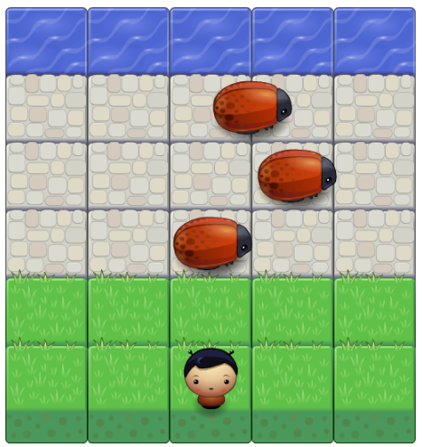

##Arcade-Game Project

## About The Game:

This game is built as part of the required projects to fulfill the Udacity front end web development track . The purpose of the project is to utilized and demonstrate the mastery of object oriented concepts studied.

## How To Load The game.

Clone this repo and open the index.html to start the game as shown below;

or 

You can play the game by pointing your browser to this [link]( https://dagbanbia.github.io/arcadeGame/)

## How To Play The game

This game is the basic requirement which was implemented.So steps to play is the requirement given by udacity.

1. The objective is for the player to reach to the top of the water.
2. use the arrow keys namely, left,right, up and down to move the player.
3. the player must avoid the enemies if he is to reach the water by using the arrow keys.
4. when the enemy collide with the player, the player comes back to where he started .
5. When he reach the water, the Game start again by the player moving back to his original starting place

NB; There is updatement to the game but due to timing factor, it will come later

## Required Dependencies

Ideally any modern browsers should be enough to open and play the game.

## Contributing

This repository is the complete code for my udacity memory Game project. I am very open for any suggestion that will improve the game.Because, I believe is part of the  learning procedure. Therefore, I am willing to  accept any pull requests to improve the game.

For details, check out [CONTRIBUTING.md](CONTRIBUTING.md).
